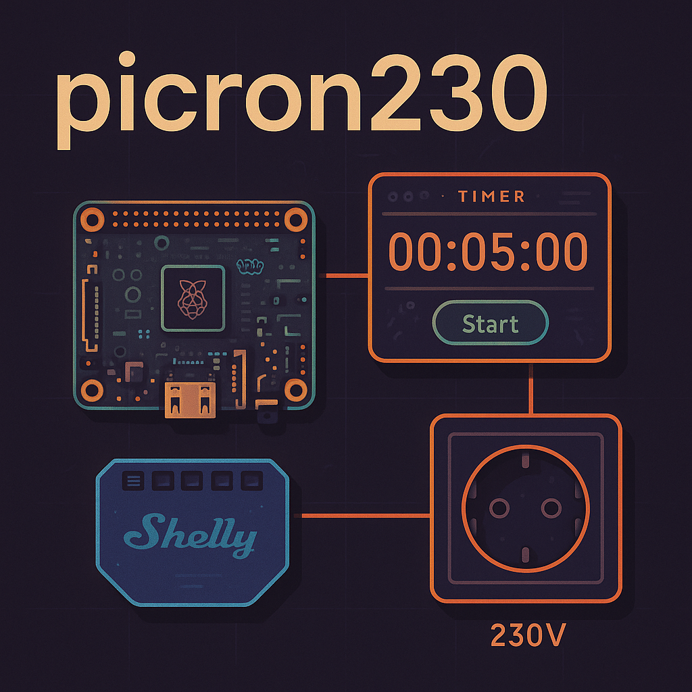

# picron230

A Raspberry Pi–powered timer switch for 230V outlets, built with Go and a
Svelte web UI. Uses a Shelly relay for safe and remote power control.

This repository keeps documentation next to the code using a docs-as-code
approach. See [docs/README.md](docs/README.md) for a full table of contents.

